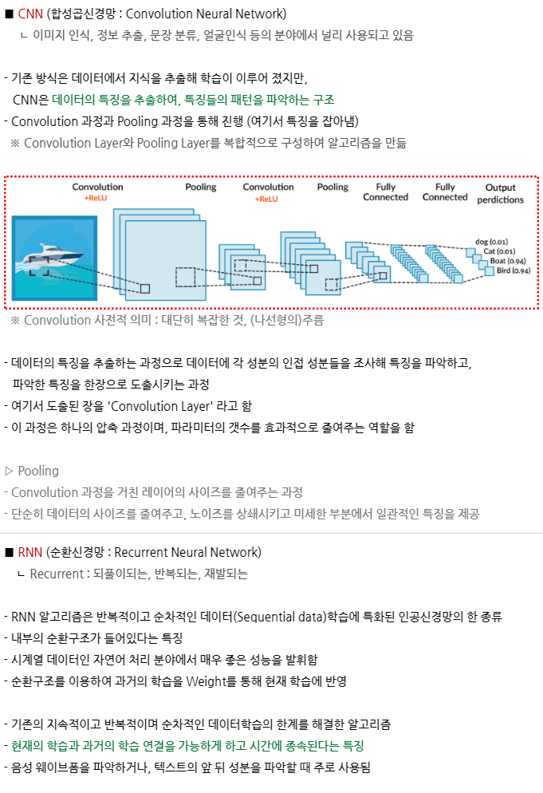
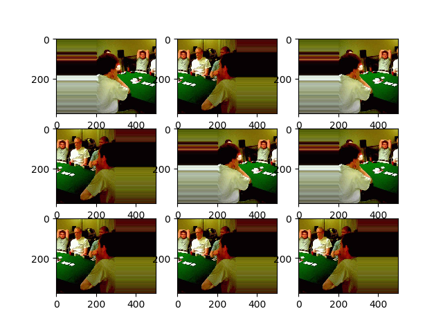
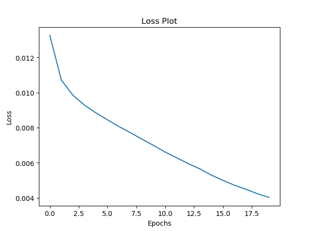
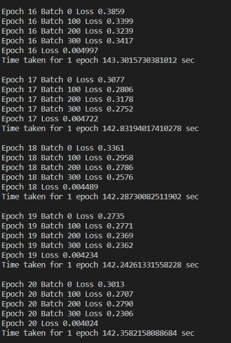
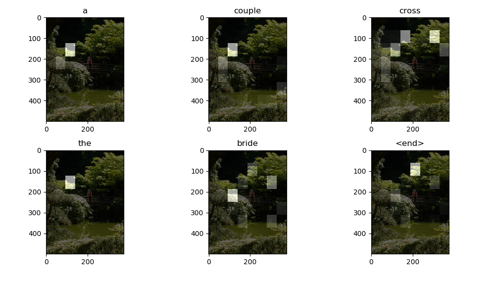
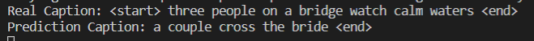
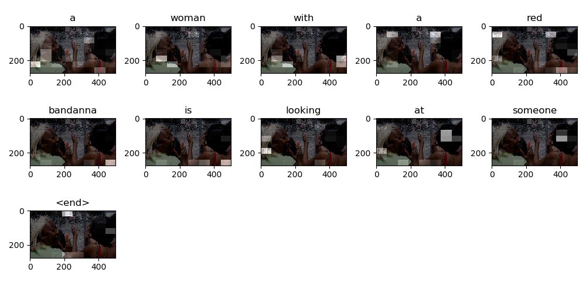
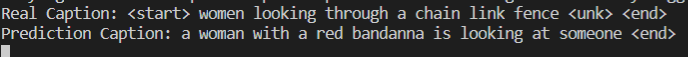

# 인공지능 프로젝트(Req9 진행중)

 - 이미지 데이터 다운로드: [https://i02lab1.p.ssafy.io/images.zip (4.07GB)](https://i02lab1.p.ssafy.io/images.zip)
 - 다운로드 받은 파일을 datasets 폴더에서 압축 해제

### 전처리과정에서 중요한 것!

모델에 적합하게 데이터를 가공하는 것. => 한번만 시행, 여러번 시행 두가지로 나뉜다.

한번만 -> 캡션 데이터의 토큰화, 전체 데이터셋 분할
매번 -> 불러온 데이터의 순서를 랜덤하게 섞는 과정, 배치 사이즈

### CNN과 RNN의 개념 정리!

## 결과

한 장 사진의 argument

### 20번 학습했을 시 손실그래프

### 20번 학습 시 결과 -1

### 20번 학습 시 결과 -2

...